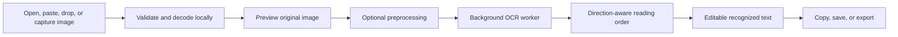
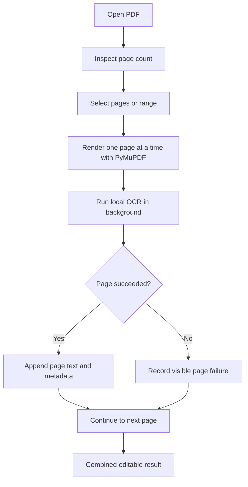
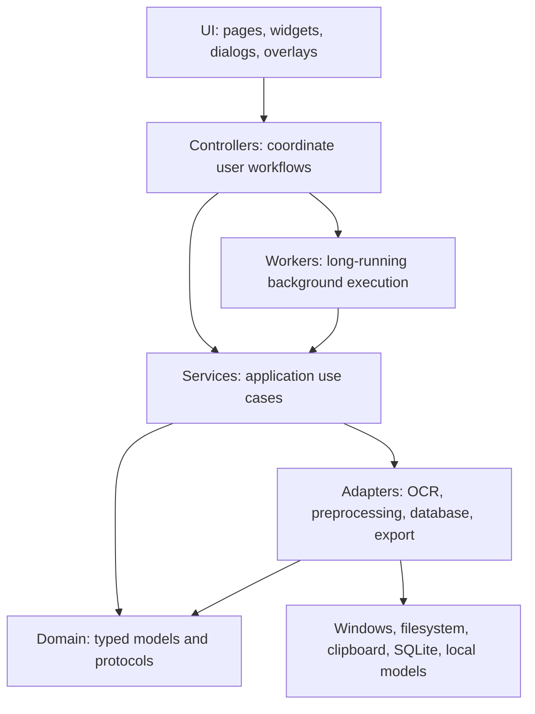

# PixelCopy Complete Project Guide

This document explains PixelCopy from the product level down to its source-code architecture. It is written for readers who may be new to desktop development, OCR, Qt, Python packaging, or the terminology used throughout the repository.

## 1. Project overview

PixelCopy is a privacy-first Windows desktop application that converts text visible in images, screenshots, clipboard images, screen selections, and scanned PDF documents into editable text.

Its central promise is:

> Copy text from anything you can see.

PixelCopy is useful when normal copy and paste is unavailable—for example, when text appears inside a screenshot, scanned page, video frame, application canvas, or image-only PDF.

The project is currently pre-alpha and targets Windows 10 and Windows 11. It is implemented as a typed Python application with a PySide6 graphical interface. Recognition, image processing, PDF rendering, history, and exports run locally. PixelCopy does not send user images or recognized text to a cloud service.

### Implemented capabilities

- Import PNG, JPEG, BMP, TIFF, and WebP images.
- Open files, paste clipboard images, drag and drop, or capture a screen region.
- Preview and zoom the original or processed image.
- Preprocess images using named profiles or explicit controls.
- Recognize English, Arabic, and mixed English/Arabic content with PaddleOCR.
- Edit, find, replace, clean, copy, and export recognized text.
- Process image-only or scanned PDF pages.
- Save optional local history when the user explicitly enables it.
- Export TXT, Markdown, JSON, CSV, and searchable PDF files.
- Use light and dark themes, keyboard navigation, and accessible control labels.
- Build a Python-free Windows portable directory with PyInstaller.

### Deliberately excluded capabilities

- Generative AI, LLM correction, rewriting, translation, or summarization.
- Cloud OCR or uploading user documents.
- Analytics, telemetry, advertising, or remote crash reporting.
- Silent guessing when OCR confidence is low.
- History storage unless the user enables it and explicitly saves a result.

## 2. Main user workflows

### Image-to-text workflow



1. The user supplies an image.
2. `ImageImportService` validates the actual file content rather than trusting only its filename extension.
3. Pillow decodes the image and applies its display orientation without altering the original file.
4. The UI displays an immutable `ImageDocument`.
5. The user may preview preprocessing operations such as grayscale, contrast, denoise, deskew, or upscale.
6. `OCRController` sends an `OCRRequest` to an `OCRWorker` running on a background Qt thread.
7. `PaddleOCREngine` loads the appropriate local model and normalizes its output into typed `OCRBlock` objects.
8. PixelCopy sorts the blocks geometrically for left-to-right or right-to-left reading.
9. The result remains editable. Copy, cleanup, history, and export operations use the edited text rather than silently reverting to the first OCR result.

### Screen-capture workflow

1. The user clicks Capture or presses the configured global hotkey.
2. `WindowsGlobalShortcut` receives the Windows hotkey event.
3. `ScreenCaptureOverlay` covers the combined desktop area, including monitors with negative coordinates.
4. The user selects a rectangular region.
5. `ScreenshotService` converts logical screen coordinates into physical pixels for each monitor's scale factor.
6. The captured pixels enter the same validated image-import workflow used by ordinary files.

### Scanned-PDF workflow



PDF pages are rendered incrementally so the program does not keep every full-resolution page in memory. Cancellation and progress are reported through worker signals. A page failure remains visible and can be retried; PixelCopy does not silently omit it.

### Optional-history workflow

History is disabled by default. Enabling history changes permission, not behavior retroactively. A result is stored only after the user clicks Save. The SQLite database supports search, rename, favorites, deletion, and full-text indexing.

## 3. Architectural approach

PixelCopy uses a layered architecture with presentation, orchestration, domain models, services, infrastructure adapters, and background workers kept separate.



The arrows represent dependencies or calls, not inheritance. Domain objects are intentionally independent of PySide6 so recognition rules can be tested without starting a GUI.

### Presentation layer: `ui`

The `src/pixelcopy/ui` package owns what users see:

- `main_window.py` creates the application shell and switches between pages.
- `navigation.py` owns the sidebar and page shortcuts.
- `pages/` contains Extract, PDF, History, Settings, and About screens.
- `widgets/` contains reusable controls such as the image preview and preprocessing panel.
- `dialogs/` contains focused modal or modeless interactions such as find/replace.
- `overlays/` contains the full-desktop screen-capture selection overlay.
- `styles/theme.py` contains semantic design tokens and generated light/dark QSS.

UI widgets display state and emit signals. They do not run OCR, write databases, render large PDFs, or perform other expensive business operations.

### Controller layer: `controllers`

Controllers connect UI signals to application behavior:

- `ImageImportController` coordinates file, clipboard, and drop imports.
- `OCRController` owns the current OCR request and worker thread.
- `PreprocessingController` manages processed previews and original restoration.
- `CaptureController` manages the shortcut, overlay, screenshot, and focus restoration.
- `PDFController` manages PDF inspection, thumbnails, page OCR, retry, and cancellation.
- `HistoryController` enforces the history permission and explicit-save rule.
- `ExportController` connects edited results to exporter selection and file dialogs.

This separation prevents a button class from becoming responsible for file validation, thread management, OCR decisions, and error handling at the same time.

### Domain layer: `domain`

The domain package defines the stable language of the application through typed dataclasses, enums, exceptions, and protocols.

Examples include:

- `ImageDocument`: immutable decoded image pixels and metadata.
- `OCRRequest`: an image plus recognition options.
- `OCROptions`: language, reading mode, orientation, and confidence threshold.
- `OCRBlock`: recognized text, confidence, bounding box, page, and metadata.
- `OCRResult`: complete recognized text plus its structured evidence.
- `PreprocessingOptions`: deterministic image-transformation choices.
- PDF, history, and export models.

Because these objects contain no Qt widget logic, unit tests can exercise them quickly and deterministically.

### Service layer: `services`

Services implement application use cases and hide infrastructure details:

- `ImageImportService` validates and decodes untrusted image data.
- `OCRService` applies shared filtering and invokes an OCR engine protocol.
- `PDFService` inspects and renders PDF pages.
- `ScreenshotService` combines selected areas across scaled monitors.
- `ExportService` chooses an exporter and validates destinations.
- `WindowsGlobalShortcut` wraps the Windows `RegisterHotKey` API.

Services receive explicit inputs and return typed values or actionable exceptions. They do not reach into UI controls.

### Adapter packages

Adapters implement external or replaceable technology contracts:

- `ocr/` provides PaddleOCR and deterministic fake engines plus reading-order logic.
- `preprocessing/` implements the OpenCV transformation pipeline and profiles.
- `database/` implements the local SQLite schema and history repository.
- `export/` implements text, Markdown, JSON, CSV, and searchable-PDF exporters.

The design allows another OCR engine or exporter to implement the same protocol without rewriting controllers or pages. Tesseract is declared as an optional dependency but its production fallback adapter remains future work.

### Worker layer: `workers`

OCR, preprocessing, thumbnail creation, PDF rendering, and multi-page PDF OCR can take long enough to freeze a GUI. Worker objects run these operations away from the GUI thread and report:

- progress;
- success;
- cancellation;
- understandable errors; and
- final cleanup.

Qt signals safely return results to the main thread. Cancellation is cooperative: code checks a cancellation flag between expensive stages instead of forcibly terminating a thread while it owns resources.

### Configuration and utilities

- `config/constants.py` contains stable application metadata.
- `config/paths.py` discovers OS-appropriate writable directories.
- `config/settings.py` validates and persists settings as JSON.
- `utils/logging.py` configures privacy-conscious rotating technical logs.
- `utils/resources.py` resolves assets in source and frozen PyInstaller modes while preventing path traversal.

## 4. Application startup

The main startup sequence is:

1. `pixelcopy.__main__` delegates to `pixelcopy.main.main`.
2. `AppPaths` discovers and creates application-data directories.
3. Logging is configured before ordinary application work begins.
4. `create_application` creates the process-wide `QApplication`, selects Qt's Fusion style, and loads the icon.
5. Settings and the history database are opened and validated.
6. `ApplicationController` constructs the main window, services, controllers, workers, and adapters.
7. The configured theme and capture shortcut are applied.
8. The main window is shown and the Qt event loop begins.

`ApplicationController` is the composition root: it is where concrete implementations are assembled and dependencies are injected.

## 5. OCR pipeline in detail

OCR is evidence-preserving rather than text-guessing.

1. Decode or render a visual source.
2. Retain the original immutable representation.
3. Apply only the preprocessing selected by the user or profile.
4. Lazily initialize the local PaddleOCR pipeline for `en` or `ar`.
5. Run detection and recognition on the CPU.
6. Convert Paddle output fields into typed blocks and bounding boxes.
7. Remove blocks below the explicit minimum-confidence threshold.
8. Sort blocks using deterministic visual geometry.
9. Reverse horizontal ordering where appropriate for RTL content.
10. Join blocks into editable text.
11. Apply cleanup only when the user explicitly requests it.

### Supported language models

- `en`: English recognition.
- `ar`: Arabic recognition and the mixed English + Arabic mode.

The portable executable contains the OCR runtime but not model weights. The setup script downloads official models into the current user's `.paddlex` cache. Model download requests contain no document or recognized text. After setup, recognition is local.

### Preprocessing order

The stable transformation order is:

1. rotation;
2. grayscale;
3. contrast and brightness;
4. denoise;
5. sharpen;
6. threshold;
7. inversion;
8. deskew; and
9. upscale.

Each processed image is a derived in-memory document. The original input remains unchanged.

### Reading modes

- Paragraph: ordinary multi-line text.
- Single line: one primary text line.
- Sparse text: separated text regions without a dense paragraph structure.
- Table: practical table-oriented recognition and ordering.

## 6. Data, privacy, and security

### Data locations on Windows

- `%APPDATA%\PixelCopy`: roaming configuration, including settings.
- `%LOCALAPPDATA%\PixelCopy`: logs, optional history database, thumbnails, and local application data.
- `%USERPROFILE%\.paddlex`: PaddleX/PaddleOCR model cache.
- The application installation or portable directory: read-only packaged code and assets.

### Privacy boundaries

- Imported files are read locally and never modified.
- Screenshots and clipboard images remain local.
- OCR text is not logged.
- Full source paths are not logged by default.
- History is disabled by default.
- Export writes only to a user-selected destination.
- No analytics or telemetry libraries are included.
- Model setup may contact an official model host, but sends no user content.

### Input safety

- Images are validated by content and decoded with Pillow.
- Paths use `pathlib` and validated application-owned directories.
- Export refuses invalid destinations and accidental overwrite.
- Thumbnail deletion is restricted to the application-owned directory.
- Resource resolution rejects traversal outside packaged assets.
- Imported data is never interpolated into commands with `shell=True`.

## 7. User interface architecture

The five top-level pages are:

- Extract: image import, preview, preprocessing, OCR settings, editor, and result actions.
- PDF: scanned-document selection, page ranges, thumbnails, progress, retry, and combined results.
- History: optional saved results, search, favorites, rename, copy, and deletion.
- Settings: theme, capture hotkey, and privacy-related history preference.
- About: product and privacy information.

The Extract page uses a horizontal `QSplitter` so users can resize source and result panels. The preview and editor receive flexible space. Advanced processing is collapsed by default and uses a `QScrollArea` on smaller displays.

Themes are generated from semantic `DesignTokens` such as primary text, muted text, surface, border, accent, disabled, success, warning, and error. This keeps light and dark themes structurally consistent.

Accessibility rules include visible focus, logical tab order, text labels for checkboxes, accessible names for compact buttons, useful tooltips, keyboard shortcuts, readable disabled states, and local RTL direction for Arabic results.

## 8. Local history and database design

PixelCopy uses SQLite for optional history. The repository creates and migrates a versioned schema. FTS5 provides local full-text search without sending queries or content elsewhere.

The database records edited text and structured metadata only after explicit Save. Transactional triggers keep the FTS index synchronized. Deleting a history item removes its associated thumbnail only after verifying that the file belongs to PixelCopy's thumbnail directory.

## 9. Export design

Exporters implement a shared typed interface:

- TXT: plain edited text.
- Markdown: edited text in a Markdown-compatible document.
- JSON: structured OCR evidence and metadata.
- CSV: rows representing compatible recognized blocks.
- Searchable PDF: the source image plus an invisible, positioned text layer.

The searchable PDF looks like the original scanned page while allowing text selection and search. PixelCopy does not replace the visible source image with reconstructed text.

## 10. Technologies and why they are used

### Python 3.12+

The primary programming language. Python provides strong library support for desktop UI, OCR, image processing, PDF handling, testing, and Windows packaging. Production code uses complete type annotations.

### PySide6 and Qt 6

PySide6 is the official Python binding for Qt 6. Qt supplies windows, layouts, controls, signals, threads, accessibility integration, clipboard access, graphics views, styling, and the event loop.

### PaddleOCR, PaddlePaddle, and PaddleX

- PaddleOCR supplies document detection and text-recognition pipelines.
- PaddlePaddle is the numerical deep-learning runtime that executes the models.
- PaddleX supplies shared pipeline infrastructure and model management used by current PaddleOCR versions.

PixelCopy disables MKL-DNN/oneDNN for its Windows OCR pipeline because the current PaddlePaddle execution path has a known incompatibility with the model attributes used by the selected detection models. Standard CPU inference remains enabled.

### OpenCV

Provides deterministic image preprocessing such as grayscale conversion, denoising, sharpening, thresholding, deskewing, rotation, inversion, and resizing.

### Pillow

Validates, decodes, and orients imported image files. Pillow is the modern maintained fork of PIL.

### NumPy

Represents image data as efficient multidimensional arrays shared between Pillow, OpenCV, and PaddleOCR.

### PyMuPDF

Opens PDF documents, inspects page counts, renders pages and thumbnails, and supports memory-conscious incremental processing.

### SQLite and FTS5

SQLite provides an embedded local relational database requiring no server. FTS5 adds efficient full-text search for opted-in history.

### PyInstaller

Builds the Windows portable directory. `PixelCopy.spec` collects Python modules, Qt libraries, Paddle native binaries, application assets, and OCR-core package metadata. The output runs without a separately installed Python interpreter.

### pytest and pytest-qt

pytest runs unit and UI tests. pytest-qt adds Qt-aware fixtures and input/event helpers so widgets and signals can be tested without manual interaction.

### Ruff

Checks code quality, imports, common bugs, modernization rules, and formatting. It provides one fast tool for linting and consistent style.

### mypy

Statically checks Python type annotations. Strict mode catches interface mismatches before runtime.

### Hatchling

Build backend used to create installable Python packages from the `src` layout.

### GitHub Actions

Runs continuous-integration checks on repository changes. CI uses deterministic offline tests and a lightweight packaging path that does not download large OCR models.

## 11. Repository map

```text
PixelCopy/
├── src/pixelcopy/          Application source code
│   ├── config/             Settings, constants, and OS paths
│   ├── controllers/        Workflow coordination
│   ├── database/           SQLite connection, schema, repository
│   ├── domain/             Framework-independent typed models
│   ├── export/             Exporter implementations
│   ├── ocr/                OCR engines, parsing, ordering, cleanup
│   ├── preprocessing/      OpenCV pipeline and profiles
│   ├── services/           Application use cases and OS services
│   ├── ui/                 Windows, pages, dialogs, widgets, styles
│   ├── utils/              Logging and resource helpers
│   ├── workers/            Background Qt workers
│   ├── app.py              QApplication and dependency composition
│   └── main.py             Process entry point
├── tests/
│   ├── unit/               Fast framework-light behavior tests
│   └── ui/                 Qt widget and workflow tests
├── docs/                   Product and engineering documentation
├── assets/                 Packaged icons and safe resources
├── scripts/                Model, build, and release utilities
├── packaging/              Windows executable metadata
├── .github/workflows/      CI definitions
├── PixelCopy.spec          PyInstaller production specification
├── pyproject.toml          Package, dependencies, and tool settings
├── AGENTS.md               Repository rules for engineering agents
├── README.md               Project introduction and setup
├── CHANGELOG.md            User-visible changes
├── SECURITY.md             Security policy
└── LICENSE                 MIT license
```

Generated `build/` and `dist/` directories are deliberately excluded from Git.

## 12. Development setup

```powershell
git clone https://github.com/wekalop/PixelCopy.git
cd PixelCopy
python -m venv .venv
.venv\Scripts\Activate.ps1
python -m pip install --upgrade pip
python -m pip install -e ".[dev,build,ocr]"
python scripts/download_ocr_models.py --languages en ar
python -m pixelcopy
```

The `-e` installation is editable: source changes take effect without reinstalling the package.

## 13. Verification and testing

Run the standard checks from the repository root:

```powershell
python -m pytest
python -m ruff check .
python -m ruff format --check .
python -m mypy src
```

Tests do not require network access or model downloads. OCR tests normally use `FakeOCREngine` or inject a model-free fake Paddle pipeline.

Test categories include:

- domain model validation;
- image content validation and decoding;
- OCR parsing, filtering, reading order, and cancellation;
- preprocessing stage order and profiles;
- PDF inspection and worker behavior;
- database search and deletion safety;
- exporter fidelity and overwrite protection;
- UI initialization, layout, accessibility, themes, RTL, shortcuts, and workflows;
- resource and packaging configuration.

For a headless UI test environment:

```powershell
$env:QT_QPA_PLATFORM = "offscreen"
python -m pytest tests/ui
```

## 14. Windows build and release

Build and verify a production portable directory:

```powershell
python scripts/build_windows.py --archive
python scripts/verify_release.py
```

The build writes:

- `dist\PixelCopy\PixelCopy.exe`: the windowed application executable;
- `dist\PixelCopy\_internal\`: packaged Python, Qt, OCR, native libraries, and assets;
- `dist\PixelCopy-portable.zip`: optional portable archive.

The production release verifier starts the packaged executable with isolated application-data directories and initializes both cached English and Arabic OCR pipelines. It does not process a document.

The smaller `--without-ocr` build exists only for CI packaging checks and is not a usable OCR release.

## 15. Design principles for future changes

- Keep all document processing local.
- Preserve original inputs.
- Keep domain models independent of Qt.
- Put business orchestration in controllers and services, not widgets.
- Run expensive operations outside the GUI thread.
- Inject replaceable engines and exporters through typed interfaces.
- Do not log recognized text or user documents.
- Add dependencies only for a defined feature.
- Add deterministic offline tests for every completed behavior.
- Keep commits focused and use Conventional Commit messages.
- Do not commit build output, model caches, logs, settings, history, or private samples.

## 16. Acronym and terminology glossary

### General software terms

- AI — Artificial Intelligence. PixelCopy does not use generative AI or AI-based text correction; its trained OCR models are used only to recognize visible characters.
- API — Application Programming Interface. A defined way for software components to communicate. Windows `RegisterHotKey` is an OS API.
- CLI — Command-Line Interface. A program controlled with terminal commands, such as `python scripts/build_windows.py`.
- CI — Continuous Integration. Automated checks run for repository changes.
- CPU — Central Processing Unit. PixelCopy runs OCR using ordinary processor inference rather than requiring a GPU.
- DLL — Dynamic-Link Library. A Windows binary library loaded by an executable; Qt and Paddle include DLL files.
- EXE — Executable. The Windows application file extension used by `PixelCopy.exe`.
- GUI — Graphical User Interface. The windows, controls, dialogs, and visual interaction layer.
- LLM — Large Language Model. A generative text model; PixelCopy does not send text to or include an LLM.
- ML — Machine Learning. PaddleOCR uses already-trained ML models for recognition, but PixelCopy performs no model training.
- OS — Operating System. PixelCopy currently targets Microsoft Windows.
- UI — User Interface. The visible and interactive portion of the application.
- UX — User Experience. The overall clarity and usability of the product, beyond individual controls.

### OCR and language terms

- OCR — Optical Character Recognition. Converting visible text pixels into machine-editable characters.
- ISO — International Organization for Standardization. The `en` and `ar` identifiers are ISO 639-1 language codes.
- LTR — Left to Right. Text direction used by English and many other languages.
- RTL — Right to Left. Text direction used by Arabic and other scripts.
- `en` — ISO-style language code used here for English.
- `ar` — ISO-style language code used here for Arabic.
- Confidence — A numeric estimate from the OCR engine indicating how certain it is about a recognized block.
- Bounding box — Rectangle describing where recognized text appeared in the source image.
- Detection — Finding regions likely to contain text.
- Recognition — Converting a detected text region into characters.
- Reading order — The deterministic order in which visual text blocks are assembled into output text.
- Model weights — Learned numerical parameters used by the OCR neural network.
- Inference — Running an already-trained model to produce a result; PixelCopy does not train models.

### Image and display terms

- BMP — Bitmap image file format commonly supported by Windows.
- DPI — Dots Per Inch. Common shorthand for display or print scale density. Qt uses logical coordinates while capture converts to physical pixels.
- EXIF — Exchangeable Image File Format metadata. It can store camera and orientation information in image files.
- JPEG/JPG — Joint Photographic Experts Group image format, commonly used for photographs.
- PNG — Portable Network Graphics format, commonly used for lossless screenshots and transparency.
- RGB — Red, Green, Blue color channels.
- RGBA — Red, Green, Blue, Alpha channels; Alpha represents transparency.
- TIFF — Tagged Image File Format, common in scanning and document workflows.
- WebP — A modern web-oriented image format supporting lossy, lossless, and transparent images.
- Pixel — The smallest addressable element of a raster image.
- Raster image — An image represented as a grid of pixels.
- Grayscale — An image representation containing brightness without color channels.
- Thresholding — Converting or separating pixels based on brightness to improve document contrast.
- Deskew — Correcting a slightly rotated or slanted document image.
- Upscale — Increasing image dimensions before recognition.

### Document and data formats

- CSV — Comma-Separated Values. A tabular text format used for compatible OCR blocks.
- FTS/FTS5 — Full-Text Search, version 5. SQLite's indexed text-search extension.
- JSON — JavaScript Object Notation. A structured text data format used for settings and evidence export.
- Markdown/MD — Lightweight plain-text markup used for documentation and one export type.
- PDF — Portable Document Format. PixelCopy renders scanned pages and can produce searchable PDF output.
- SQL — Structured Query Language. The language used to define and query relational databases.
- SQLite — An embedded relational database stored in a local file and requiring no server.
- TOML — Tom's Obvious, Minimal Language. The configuration format used by `pyproject.toml`.
- TXT — Plain text file format.
- UTF-8 — Unicode Transformation Format, 8-bit. Text encoding used for exported and configuration text so English, Arabic, and other Unicode characters are preserved.
- ZIP — Compressed archive format used for the portable release.
- Schema — The defined structure and version of a database.
- Migration — A controlled update from one database schema version to another.

### Python, Qt, and architecture terms

- Qt — Cross-platform application framework used for the desktop GUI. It is pronounced “cute” and is not an acronym.
- PySide6 — Official Qt 6 bindings for Python.
- QSS — Qt Style Sheets. Qt's CSS-like language for styling widgets.
- CSS — Cascading Style Sheets. The web styling language that inspired QSS syntax.
- `QApplication` — The single Qt object managing the GUI application and event loop.
- `QThread` — Qt thread object used to keep long-running work away from the GUI thread.
- Signal — Qt's typed event notification mechanism.
- Slot — A callable connected to a Qt signal.
- Event loop — The continuous loop that receives input, redraws windows, and dispatches signals.
- Dataclass — A Python class focused on explicit structured data.
- Enum — Enumeration: a fixed set of named values.
- Protocol — A typed behavioral interface that implementations can satisfy without inheriting one concrete class.
- Adapter — A component translating an external library or format into an internal protocol.
- Controller — A component coordinating UI events and application workflows.
- Service — A component implementing an application use case without presentation details.
- Repository pattern — An interface that presents database storage as domain operations.
- Composition root — The startup location where concrete dependencies are constructed and connected.
- Dependency injection — Supplying a component's dependencies explicitly, improving testing and replaceability.
- Immutable — An object whose state is not changed after creation.
- `src` layout — Python project structure placing importable packages under a `src/` directory to prevent accidental imports from the repository root.

### Processing and runtime terms

- OpenCV — Open Source Computer Vision Library. Used for deterministic image preprocessing.
- PIL — Python Imaging Library. Pillow is its maintained successor.
- NumPy — Numerical Python. Provides efficient arrays and numerical operations.
- MKL-DNN — Intel Math Kernel Library for Deep Neural Networks, the former name of oneDNN.
- oneDNN — OneAPI Deep Neural Network Library, an optimized CPU execution library.
- GPU — Graphics Processing Unit. PixelCopy does not require one for its supported CPU OCR path.
- PaddleOCR — Paddle ecosystem toolkit for text detection and recognition.
- PaddlePaddle — Parallel Distributed Deep Learning platform and model runtime.
- PaddleX — Paddle ecosystem pipeline and model-management framework used by PaddleOCR.
- PyMuPDF — Python binding for the MuPDF document-rendering library.
- Tesseract — Open-source OCR engine declared as an optional future fallback.

### Development and packaging terms

- Git — Distributed version-control system used to track source changes.
- GitHub — Hosting and collaboration service for the Git repository.
- MIT — Massachusetts Institute of Technology. The permissive MIT License originated there; PixelCopy is distributed under this license.
- Conventional Commits — Commit-message convention such as `fix(packaging): include OCR metadata`.
- pytest — Python testing framework.
- pytest-qt — pytest extension for testing Qt applications.
- Ruff — Python linter and formatter.
- mypy — Static type checker for Python.
- Hatchling — Python package build backend.
- PyInstaller — Tool that freezes Python applications and dependencies into distributable executables/directories.
- Frozen application — A Python program packaged to run without a separate Python installation.
- Onedir — PyInstaller distribution containing one executable plus an internal dependency directory.
- Smoke test — Small bounded test proving that a packaged application starts and its critical runtime can initialize.
- Linting — Automated checks for mistakes, risky constructs, and style violations.
- Static typing — Checking expected value and interface types before running the program.
- Unit test — Test of one small component with controlled dependencies.
- UI test — Test that initializes or interacts with application widgets and signals.
- Regression test — Test that protects against a previously fixed defect returning.

### Windows and filesystem terms

- `%APPDATA%` — Windows environment variable for the current user's roaming application-data directory.
- `%LOCALAPPDATA%` — Windows environment variable for non-roaming local application data.
- `%USERPROFILE%` — Windows environment variable for the current user's profile directory.
- XDG — Cross-Desktop Group directory conventions used as a non-Windows development fallback.
- Hotkey — Keyboard combination registered to activate an action even when the application is not focused.
- Native event — Low-level event delivered by the operating system rather than an ordinary Qt widget event.
- Telemetry — Automatic collection and transmission of usage or performance data; PixelCopy does not include it.
- Cache — Reusable local data, such as downloaded OCR model files.

## 17. Related documentation

- [README](../README.md): installation and quick-start information.
- [Product specification](PRODUCT_SPEC.md): product principles and roadmap.
- [Architecture](ARCHITECTURE.md): concise engineering architecture.
- [OCR pipeline](OCR_PIPELINE.md): recognition stages and integrity rules.
- [UI guidelines](UI_GUIDELINES.md): visual, responsive, and accessibility conventions.
- [Privacy](PRIVACY.md): stored data and local-processing boundaries.
- [Testing](TESTING.md): test strategy and coverage.
- [Building on Windows](BUILDING_WINDOWS.md): production packaging and verification.
- [Security policy](../SECURITY.md): vulnerability reporting and security expectations.
- [Contributing](../CONTRIBUTING.md): contribution workflow.
